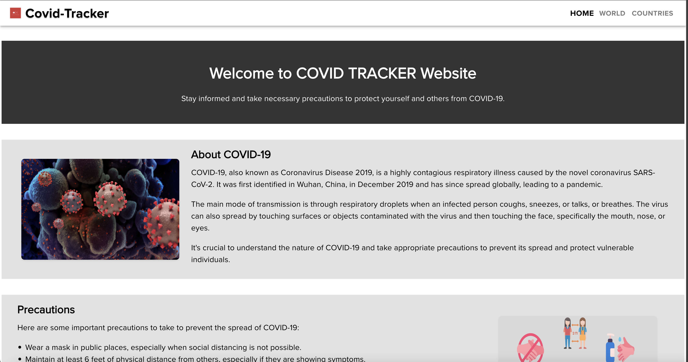
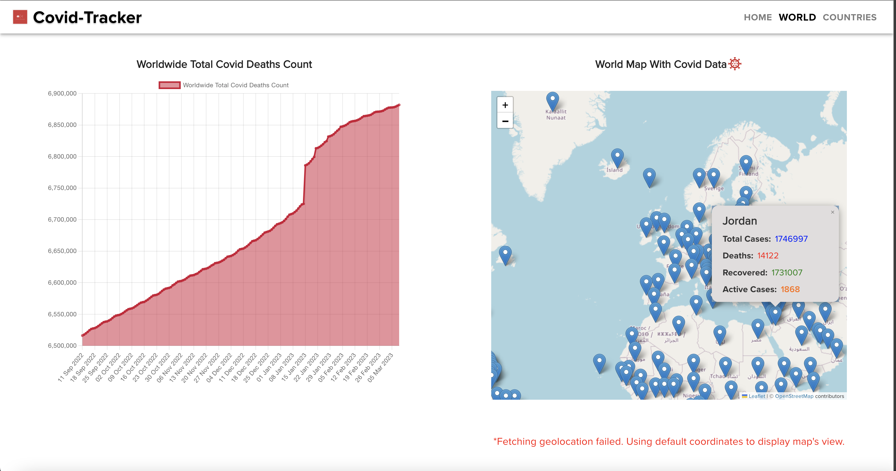
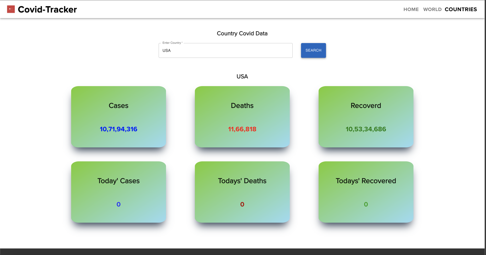

## Covid-Tracker

This is a simple React project used to show covid data of the world utilizing 'the disease.sh - Open Disease Data API'.
The project uses ReactJS, Material UI, React Router, LeafletJS and ChartJS.

It has 3 routes

- The first one is homepage which shows some genral details about covid, its symptoms, precautions and medications.

  

- It also has a 'world-map' route, where it shows the total number covid cases as a line graph and a world map that renders details regarding each countries covid data. The map uses user's geolocation if user allows else fallbacks to default. One thing to note is that the data is taken from disease.sh. Therefore, there won't be any new data after March 2023 as of the release of this project.

  

- The last one is a 'countries' page which allows the user to input a country name in search box and returns the countries covid data like cases, deaths, recoveries etc as cards
  
